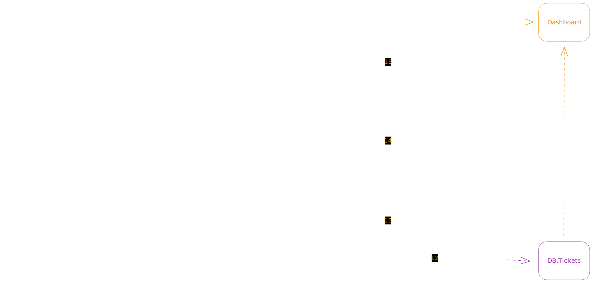

# Security Hackathon [MVP]

## Pre-requisites

- Docker
- Docker Compose
- Python

## Running Application

Running in Win11 with WSL 2

### 1. Clone this Project

### 2. Prepare Python Environment

```sh
## Create an virtual environment
# Windows:
python -m venv .venv
# Linux:
# python3 -m venv .venv

## Activate the virtual environment
# WSL 2:
source .venv/Scripts/activate
# Linux: 
# source .venv/bin/activate
# Windows: 
# .venv/bin/activate

## Update pip 
python -m pip install -U pip 

## install Requirements
pip install -r requirements.txt

## (Optional) Install dev dependencies
# pip install isort blue pytest bandit
```

### 3. Run Application

```sh
source run.sh
```

## Process



## History Telling

1. Toda `aplicação` durante o processo de desenvolvimento passa por
2. `ferramentas de segurança` que geram reports de segurança.
3. Assim que gerados, esses `arquivos de report` serão salvos no
4. `diretório` especificado e, em seguida,
5. `escaneados` pela
6. `nossa aplicação` e, na sequencia,
7. `salvos` no
8. `banco de dados`. Periodicamente, esses reports serão
9. `verificados` para checar a existência de novos findings.
10. Para cada novo finding, a `nossa aplicação` irá
11. `criar um ticket`
12. no `gerenciador de projetos` (Jira).
13. Todos os tickets serão `escaneados` periodicamente e,
14. assim que encerrados, `nossa aplicação`
15. `atualizará` o status do finding no
16. `banco de dados`.

## References
